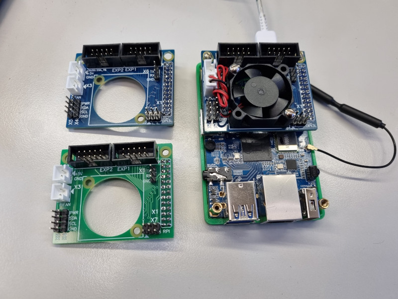
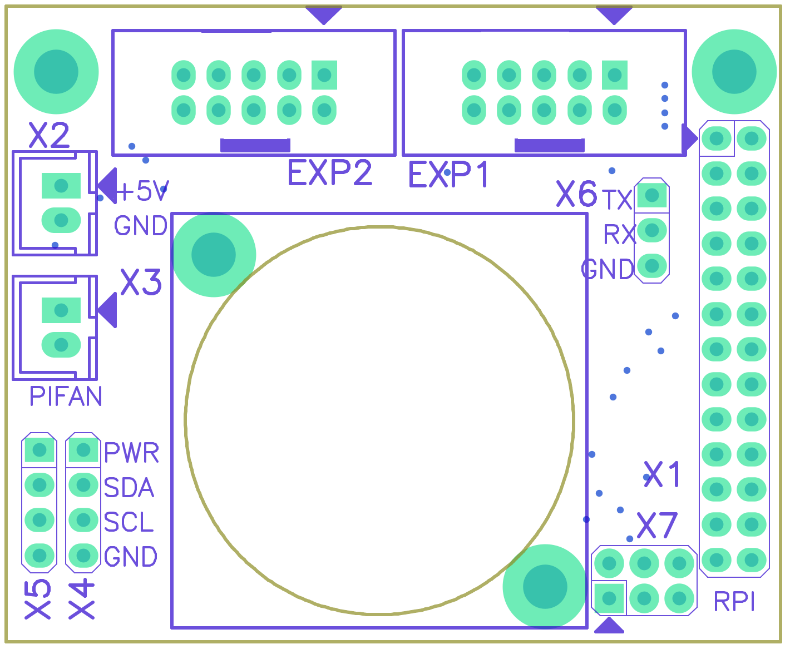
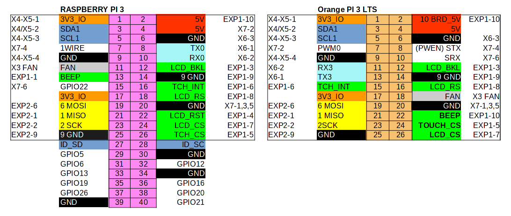
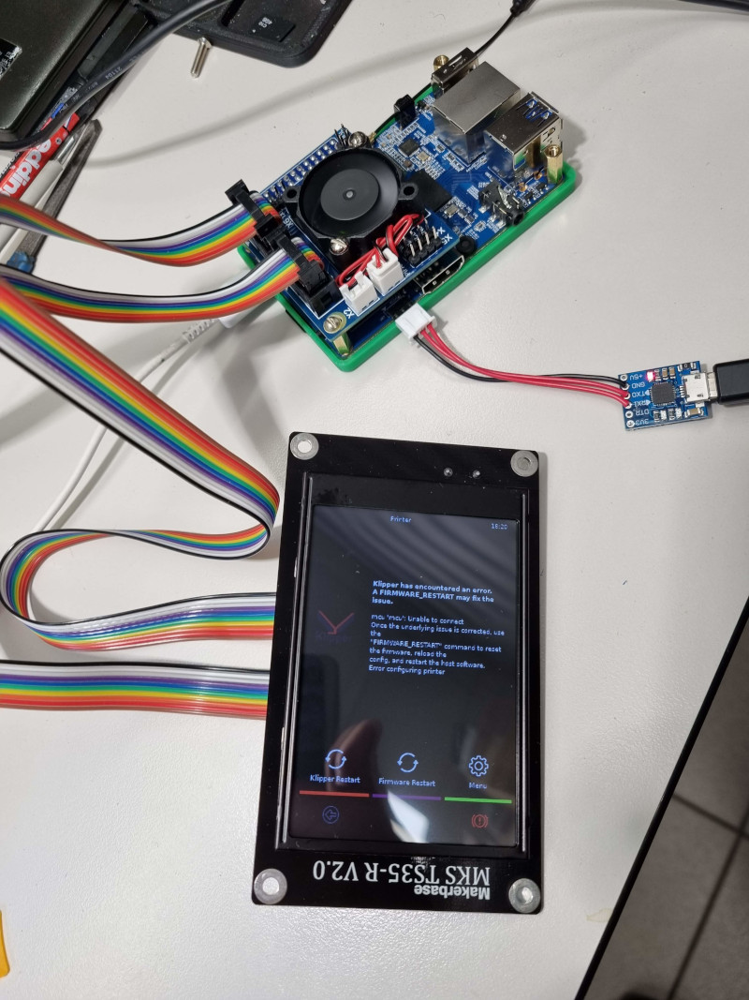

# kross-pi-hat

Кросс-плата для подключения 3.5" штатных экранов 3D-принтеров Flying Bear Ghost6 и Reborn2 к одноплатным компьютерам OrangePi 3LTS и Raspberry Pi 3/4

Подключение производится родными шлейфами IDC10 без необходимости использовать одиночные соединители Dupont. Также кросс-плата предостваляет возможность установки управляемого вентилятора формата 3007 или 3010 5В.

На плате присутствует разъём XH2.54, позволяющий подать питание +5В на одноплатный компьютер без необходимости использовать кабель USB Type-C.

Дополнительно на плате выведены два 4-контактных разъёма I2C, а также оставшиеся неиспользованными линии GPIO.

В настоящее время существует 2 типа платы - для OrangePi 3LTS (синяя маска) и для Raspberry Pi3 (зелёная маска). Различаются схемой соединения GPIO и расположением монтажных стоек.

### Размещение разъёмов на плате.

### Назначение разъёмов

| Обозначение | Назначение                                      | Ответный тип |
|----|----------------------------------------------------------|-------|
| X1 | Соединение с GPIO-разъёмом на одноплатном компьютере     | PLD26 |
| X2 | PWR+5V, подача питания на одноплатный компьютер          | XH2.54F-2 |
| X3 | Подключение управлякмого вентилятора 3007/3010 5В        | XH2.54F-2 |
| X4, X5 | Подключение устройств I2C. Интерфейс 3.3В            | BLS-04 |
| X6 | соединение UART с платой управления принтером (MCU-UART) | BLS-03 |
| X7 | Свободные пины GPIO                                      | BLD-06 |
| EXP1, EXP2 | подключение 3.5" TFT дисплея                     | IDC10F, шлейф |

### Таблица соединений

Подключение ЖКИ соответствует известным руководствам https://github.com/Sergey1560/fb4s_howto/blob/master/mks_ts35/ и https://github.com/evgs/FBG6-Klipper/blob/main/Klipperscreen-RPI.md.

***ВНИМАНИЕ*** При подключении соблюдать нумерацию разъёмов и выводов! EXP1->EXP1, EXP2->EXP2. 
Если возникли сомнения, соединить только разъёем EXP1, и прозвонить соответствие связности линий GND и +5V между кросс-платой и модулем дисплея.

***Внимание*** MKS традиционно использует перевёрнутые разъёмы IDC10, из-за чего обозначение первого вывода разъёма на плате и на шлейфе не совпадает.
Ошибка известная, давно перешедшая в ранг "особенность", поэтому воспроизведена на разработанных кросс-платах.
Разъёмы запаяны развёрнуто, и можно использовать комплектные шлейфы без каких-либо переделок.

### Управляемая периферия

Кроме непосредственно дисплея, кросс-плата позволяет управлять подсветкой дисплея, активным зуммером на плате дисплея, вентилятором и реле питания 3d-принтера.
Также предоставляются разъёмы для подключения UART и I2C

|Функция  |Разъём|GPIO Raspberry PI|GPIO Orange Pi|
|---------|------|-----------------|--------------|
|Backlight|EXP1-3|GPIO18 (WPI1)    |PD18 (WOP6)   |
|FAN      |X3    |GPIO17 (WPI0)    |PD16 (WOP10)  |
|BUZZER   |EXP1-1|GPIO27 (WPI2)    |PD21 (WOP13)  |
|PWREN    |X7-4  |work in progress |PL02 (WOP3)   |
|UART RXD |X6-2  |GPIO14 (ttyAMA0) |PD24 (ttyS3)  |
|UART TXD |X6-1  |GPIO15 (ttyAMA0) |PD23 (ttyS3)  |
|I2C1 SDA |X4-2  |GPIO2 (i2c1)     |PD26 (i2c0)   | 
|I2C1 SCL |X4-3  |GPIO3 (i2c1)     |PD25 (i2c0)   | 

По управлению питанием см. https://github.com/evgs/OrangePi3Lts/tree/main/power

Управление вентилятором https://github.com/evgs/kross-pi-hat/blob/main/fan.md

Управление звуковым излучателем https://github.com/evgs/kross-pi-hat/blob/main/buzzer.md

Подключение датчиков по I2C, на примере BME280 https://github.com/Tombraider2006/klipperFB6/tree/main/bme280
